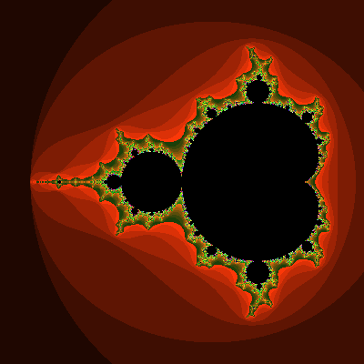

# Mandelbrot Deepzoom implemented in .NET Blazor WebAssembly
Strangely there are not a lot of open source implementations of infinite zoom Mandelbrot fractal viewers available or at least discoverable on the Internet.

## Perturbation: SuperFractalThing as starting point

This repository has taken the source code from the java SuperFractalThing implementation as can be found on SourceForge: https://sourceforge.net/projects/suprfractalthng/

This is the original java implementation by Kevin Martin who has devised a perturbation based algorithm for generating Mandelbrot fractal views. This enables deeply zoomed instances being calculated by inherently limited hardware float operations. The trick is to calculate a reference point with arbitrary precision BigDecimal perations and then use this reference point using perturbation in order to calculate the remainder of the plane. With his software beautiful videos are created, e.g. https://www.youtube.com/watch?v=k_opcQ7vEdk.

Kevin Martin's original writing on his perturbation based algorithm can be found via the following link: 
http://superfractalthing.co.nf/sft_maths.pdf
As his domain is currently down, one can find the same pdf on the following link:
http://www.science.eclipse.co.uk/sft_maths.pdf

Claude Heiland-Allen has provided another perspective on the same:
https://mathr.co.uk/mandelbrot/perturbation.pdf

The basic idea of perturbation is that if you substract two big numbers that are closely together, you will get a number that will fit in a hardware float. E.g.

```
1,234,567
1,234,560 -
---------
        7
```

## Port to .NET: BigDecimal
For calculating the reference point you will need arbitrary precision arithmetics. .NET does not provide means out of the box to operate with arbitrary precision floating point numbers. It only provides a `BigInteger` type. Java on the other hand provides the `BigDecimal` type.
We have found dparker1's implementation on GitHub: https://github.com/dparker1/BigDecimal/ and extended it a bit in order to match the requirements by the java BigDecimal consumer. We also started to port the java reference implementation, but this is still work in progress.

## Running .NET in the browser: Blazor
Microsoft is currently working on a .NET runtime in the browser as part of Blazor WebAssembly. We noticed right away that calculating the fractal in the WebAssembly .NET runtime is incredibly slow. This is obviously caused by the fact that the runtime currently just interprets the intermediate language instead of running a compiled WebAssembly binary. Another fact is that WebAssembly currently does not have immediate access to the html5 DOM and apis. So interacting with an html5 canvas element has to go through JavaScript interop. Interestingly, Rust has a wrapper library called `web_sys`. 

## Screenshot


## Other implementations
We could not find that much of perturbation based implementations on the Internet. Nevertheless, one is of particular interest as this is a WebGL based implementation by munrocket that is applying GL shader language in order to execute the Mandelbrot algorithm on GPU. It provides an impressive framerate. Review his repo: https://github.com/munrocket/deep-fractal

## Contact
You can reach out to me via Twitter: https://twitter.com/cveld or raise a GitHub issue.
